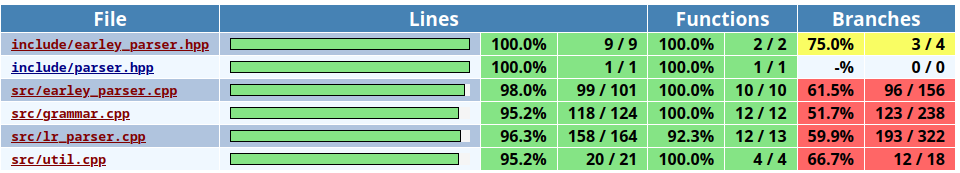

# Parser algorithms

## Building

```bash
mkdir build && cd build
cmake -DCMAKE_BUILD_TYPE=Debug ..
make -j<num_cores+1>
```

## Code coverage
```bash
make parser-coverage -j<num_cores+1>
```



## Running

The main program is `./bin/run`. To run it pass file with grammar description
and file with word

```bash
./bin/run -g <grammar_file> -w <word_file> -p <earley/lr1>
```

-g indicated path to grammar file, -w -- path to word file, -p -- parser type

#### Grammar file format
```
[non_terminal1] -> [rule1]|[rule2]|...
[non_terminal2] -> [rule1]|[rule2]|...
...
[non_terminalN] -> [rule1]|[rule2]|...

[terminal symbols]

[non terminal symbols]

[start non terminal symbol]
```

#### Word file format
```
[word]
```

All tokens need to be separated by space. Non terminals must not start with '_'.
Non terminals and terminals must not be equal to '$'.

#### Example
```
S -> ( S ) S|

( )

S

S
```

```
( ( ( ) ) )
```
